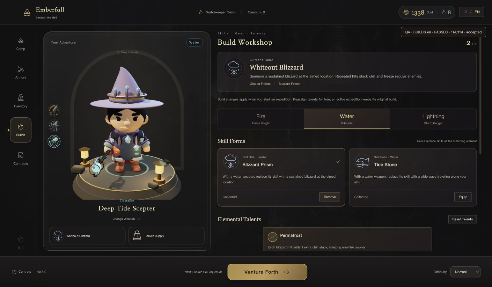
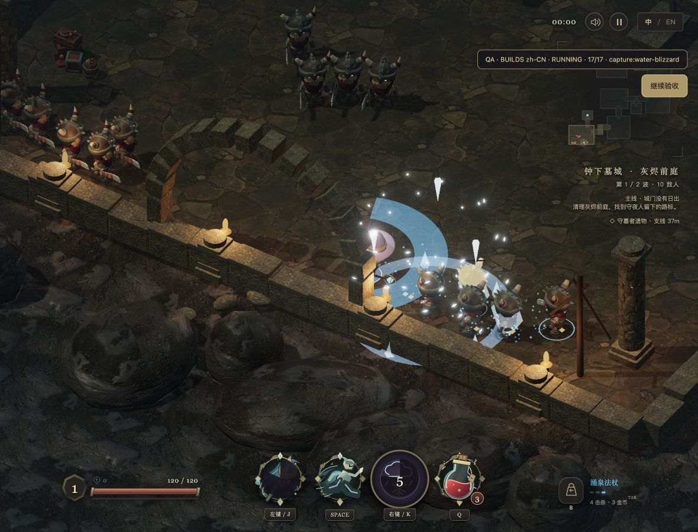
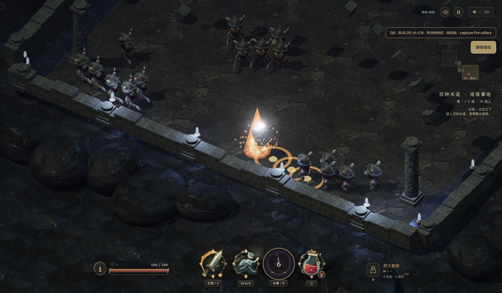

<div align="center">

# EMBERFALL

### Beneath the Bell

A single-player 3D action roguelite. Build your loadout, descend into the ruins, and bring the city's story back to camp.

**v0.8.0 · Browser · Single-player · [MIT](LICENSE)**

[简体中文](README.md) · **English**

**[Play now ↗](https://game.novai.ink/)** · [Quick start](#quick-start) · [Development](#development) · [Report an issue](https://github.com/we1jia/emberfall/issues)

</div>



<table>
  <tr>
    <td width="50%"></td>
    <td width="50%"></td>
  </tr>
  <tr>
    <td align="center">Whiteout Blizzard · Falling ice and freezing</td>
    <td align="center">Earthfire Pillars · Directional eruptions and echoes</td>
  </tr>
</table>

<sub>In-game screenshots from v0.8 automated acceptance checks, with QA markers retained.</sub>

## Overview

Emberfall follows a repeatable expedition loop: prepare at camp, fight through connected dungeon regions, choose blessings, explore side paths, and return with loot and story evidence.

| System | Available in v0.8 |
| --- | --- |
| Campaign | Two chapters and seven story quests: six regions and two side paths in **Beneath the Bell**, followed by three regions in the **Sunken Bell Aqueduct** |
| Combat | Fire, lightning, and water; three weapon-based classes, six weapons, dodging, healing, temporary buffs, and boss encounters |
| Builds | Six skill relics with different attack patterns, three armor pieces, and nine talent nodes |
| Camp | Armory, inventory, supplies, permanent upgrades, and four contracts |
| Presentation | Rounded 3D characters, visible equipment changes, and a dark interface with warm accents |
| Language and saves | Instant Simplified Chinese / English switching, saved language preference, and browser-local camp progress |

The project is actively developed. Its two chapters are playable, but it is not yet a complete commercial release. Maps are authored rather than procedurally generated; open-world exploration, randomized item affixes, cloud saves, and multiplayer are not implemented.

## Getting started

**[Open game.novai.ink](https://game.novai.ink/)** and play directly in your browser. A desktop with a keyboard and mouse is recommended; no download, Node.js installation, or account is required.

1. **Prepare at camp.** Choose a chapter and difficulty. In the Armory, select a weapon and click **Equip** to change your class. Inspecting a card alone does not equip it. Open **Builds** for relics, armor, and talents; pack one supply in **Inventory**.
2. **Explore and fight.** Clear each region, press `E` to claim a blessing, and follow the corridors onward. Investigate side paths and interact with story objects. Blessings and temporary buffs last for the current expedition.
3. **Return and progress.** Claim story rewards in the **Story Journal** to unlock the next chapter. Spend your earnings on gear and camp upgrades, then prepare another expedition.

Use **中 / EN** in the upper-right corner to change the interface language without restarting the game or resetting progress. The default language is Simplified Chinese.

<details>
<summary>Chapter progression and expedition rewards</summary>

- **Chapter I — Beneath the Bell:** clear the Ashen Courtyard, explore the burial side path, and press `E` at the Gravekeeper's Relic. After clearing the Molten Foundry, approach the **Bellmaker's Sigil** and hold `E` for **2.4 seconds**. Releasing the key, moving away, or taking damage interrupts the interaction.
- Defeat the **Deathknell Warden**, return to camp, and claim the first four story rewards in order. This unlocks the **Sunken Bell Aqueduct**. You can collect all required evidence in one expedition; you do not need four separate clears. Missing evidence can be collected later.
- **Chapter II — Sunken Bell Aqueduct:** avoid water-pressure hazards, clear the Broken-Bridge Sluice, and hold `E` at the sluice wheel. Opening it reduces the **Undertow Warden's** damage by **20%** for that expedition. The center of its tidal ring is safe; moving outside the ring also avoids it.
- Claim the final three story rewards after completing the aqueduct. Both chapters remain available for repeat expeditions. Story rewards are granted once; repeat runs still earn ordinary loot.
- Defeat returns **60%** of the expedition's gold; voluntary retreat returns **25%**. Recorded investigation evidence survives settlement, but boss-related story evidence requires victory in that chapter.
- Reloading the page cannot restore an active battlefield. You can settle the recorded expedition summary and prepare a new run.

</details>

## Classes and builds

Your equipped weapon determines your class and original skill. Advanced weapons can be permanently unlocked through expedition loot and contract rewards.

| Class | Starting / advanced weapon | Original playstyle |
| --- | --- | --- |
| Flame Knight | Ember Longsword / Cinder King's Greatsword | Melee strikes, fire fields, lingering burns, and brief damage boosts |
| Storm Ranger | Lightning Spear / Storm Halberd | Fast thrusts, lightning bursts, chains, and attack-speed boosts |
| Tidecaller | Wellspring Staff / Deep Tide Scepter | Sustained water attacks, slows, and protective shields |

Advanced weapons change the character's weapon, armor details, and headgear in both camp and combat. Separately equipped armor adds its own visible appearance; removing it restores the underlying outfit.

In **Builds**, select an element and equip a skill relic. The element tabs filter the workshop; the character icons on the left switch your class. A relic only replaces the skill of a **matching-element weapon**. Switching to another element restores that weapon's original skill. Existing saves keep their original skills until a relic is equipped.

| Element | Skill relic → skill form | Behavior and build options |
| --- | --- | --- |
| Fire | Earthfire Ember → **Earthfire Pillars** | Sequential eruptions along your aim; add an Aftershock echo or extra pillars with Magmatic Pressure |
| Fire | Meteor Core → **Falling Star** | A delayed strike at the aimed location, followed by burning ground; Aftershock adds an impact echo |
| Water | Blizzard Prism → **Whiteout Blizzard** | A sustained storm that stacks chill and freezes regular enemies; choose Shatter explosions or longer coverage with Whiteout |
| Water | Tide Stone → **Torrent** | A wide traveling wave that hits each enemy once, pushes it back, and slows it |
| Lightning | Lightning Coil → **Chain Lightning** | Jumps between nearby targets after the initial aimed hit; choose an Overload explosion or capped cooldown refunds with Feedback |
| Lightning | Storm Prism → **Storm Lances** | Three piercing directional lances; overlapping lances do not damage the same target more than once |

**Armor** supports the matching element: Ash Mantle boosts fire skill damage, Glacier Robes increase water damage against slowed or frozen enemies, and Storm Vest adds a chain target and reduces lightning skill cooldowns.

**Talents** start with three points. Your first three victories each add one point, for a maximum of six shared across all elements. Each element has one prerequisite and two mutually exclusive branches. Respecs are free; removing a prerequisite also removes its dependent talent. Check each node's description, as not every node benefits every skill of its element.

Armor, relics, and talents are fixed when an expedition begins. Preparing a new loadout while a previous expedition awaits settlement affects the **next** run. Press `B` in combat to inspect the current expedition's equipment.

<details>
<summary>Gear prices and combat limits</summary>

- Earthfire Ember, Blizzard Prism, and Lightning Coil are included in the starting collection. The other three relics cost **100 gold each**.
- Each armor piece costs **70 gold**. Owned gear is not charged for again.
- Gold comes from expedition settlement, story rewards, and contracts. Supplies are consumed when departing.
- Boss freezes are limited in duration and frequency. Shatter cannot recursively trigger another Shatter, and Feedback refunds at most **one second per cast**.
- Effect quality settings reduce visual object and particle budgets. Temporary effects are cleaned up when changing regions or returning to camp.

</details>

## Controls

| Action | Input |
| --- | --- |
| Move / aim | `W A S D` / mouse |
| Basic attack | Left click or `J` |
| Aim and cast current skill | Right click or `K` |
| Dodge / drink a potion | `Space` / `Q` |
| Claim a cleared-region reward / interact | `E` |
| Operate the sigil or sluice wheel | Hold `E` for 2.4 seconds; release, movement away, or damage interrupts |
| Choose a blessing | Click a card or press `1`, `2`, `3` |
| Equipment panel / cycle elements | `B` / `Tab` |
| Pause / back | `Esc` |

## Quick start

The [hosted game](https://game.novai.ink/) requires no local setup. To run or develop the project locally, use **Node.js 22.12 or a newer 22.x release**, plus npm.

The `main` branch contains the current playable version:

```sh
git clone --branch main https://github.com/we1jia/emberfall.git
cd emberfall
npm ci
npm run dev
```

Open [http://127.0.0.1:4173/](http://127.0.0.1:4173/).

To build and preview the production bundle:

```sh
npm run build
npm run preview
```

On macOS, after installing dependencies and building, you can also double-click `开始游戏.command` or run `./开始游戏.command`. This launcher requires **Python 3** and serves the built `dist/` directory.

`node_modules/` and `dist/` are not committed. All local launch methods use port **4173**; run only one at a time. Keep the terminal open and press `Ctrl+C` to stop the server. Models and textures are included, so Blender is not required to play.

**Save data stays in the current browser and site origin.** The hosted site and your local server have separate saves. Progress does not sync across browsers or devices, and clearing site data removes it. Active battles cannot be resumed after closing or refreshing the page.

## Development

Built with **JavaScript, Three.js, and Vite**. Blender source files and asset tooling are included for further development.

| Command | Purpose |
| --- | --- |
| `npm run dev` | Start the local development server |
| `npm run build` | Build the production bundle into `dist/` |
| `npm run preview` | Serve the production bundle locally |
| `npm test` | Run the complete Node test suite |
| `npm run test:flow` | Run the Node flow-test subset and write logs, JUnit, and JSON reports |

### Verification records

The **v0.8 acceptance run on October 2, 2026** recorded **253/253 passing logic tests**, including a **182/182 flow-test subset**. The subset is part of the total, not an additional 182 tests. These figures describe archived release checks; rerun the appropriate checks after making changes. Reports and screenshots are linked in the [v0.8 acceptance record](docs/v0.8-acceptance.md).

Browser checks recorded **114/114 in Chinese** and **113/113 in English**. They covered a complete Blizzard run through Chapter I, story rewards, aqueduct unlocks, and combat encounters for the other five skill forms. Full victories for all six forms across both chapters were covered separately by a **12-run Node input matrix**.

Combat automation uses an input bot with access to enemy and hazard positions. Its results verify functionality and progression paths; they do not establish human difficulty, long-term balance, or performance across devices. Object-budget checks are not frame-rate benchmarks.

<details>
<summary>Run the browser acceptance flows</summary>

Start the local server, then open one of these routes:

| Flow | Simplified Chinese | English |
| --- | --- | --- |
| Camp and expedition | [Run](http://127.0.0.1:4173/?qa=1&flow=1&seed=913) | [Run](http://127.0.0.1:4173/?qa=1&flow=1&seed=913&lang=en) |
| Two-chapter campaign | [Run](http://127.0.0.1:4173/?qa=1&campaign=1&seed=913) | [Run](http://127.0.0.1:4173/?qa=1&campaign=1&seed=913&lang=en) |
| Builds and skill forms | [Run](http://127.0.0.1:4173/?qa=1&builds=1&seed=913) | [Run](http://127.0.0.1:4173/?qa=1&builds=1&seed=913&lang=en) |

These routes use isolated test saves to preserve ordinary game progress. Inspect the on-screen result and the corresponding report at `window.__emberfallFlow`, `window.__emberfallCampaignFlow`, or `window.__emberfallBuildFlow`.

The campaign flow exercises chapter selection, story claims, and equipment changes. Hold-to-interact checks also pass through browser keyboard listeners and animation frames. `npm run test:flow` runs Node tests only; it does not launch a browser.

See the [flow-testing notes](docs/flow-automation.md) and [v0.7 campaign acceptance](docs/v0.7-acceptance.md) for earlier evidence and implementation details.

</details>

### Repository layout

| Directory | Contents |
| --- | --- |
| `src/` | Combat, maps, camp systems, animation, localization, and interface |
| `public/` | Runtime models, textures, icons, audio, and asset licenses |
| `blender/` | Editable Blender files and modeling scripts |
| `tests/` | Combat, camp, interaction, and regression tests |
| `tools/` | Local launcher, asset generation, and validation utilities |
| `docs/` | Design, gameplay, asset sources, and acceptance records |
| `artifacts/` | Version screenshots and verification outputs |

## Project status

v0.8 provides two playable chapters, repeat expeditions, persistent camp progression, equipment builds, and a seven-quest story arc. Story is presented through the journal and quest interface; in-world NPC conversations and voice acting are not implemented.

Further work is organized around deeper builds, more routes and content, and release quality. Randomized item affixes, equipment dismantling, cloud saves, multiplayer, and a full open world remain outside the current implementation. Cross-device performance, long-term replay value, and balance need further playtesting. See the [product roadmap](docs/product-roadmap-plan.md) for the development plan and its delivery stages.

## Contributing

Bug reports and focused improvements are welcome. Include your browser and operating system, the steps to reproduce the issue, expected and actual behavior, and a screenshot or console error when available. For gameplay feedback, include the chapter, difficulty, weapon, relic, armor, and talents involved.

For code changes, branch from `develop`, keep the scope focused, and target `develop` with your pull request. Run the checks relevant to your change and document what you verified. `main` carries the playable release; releases are merged back into `develop`. See [AGENTS.md](AGENTS.md) for the project's Gitflow and delivery conventions.

## License and credits

Original project content is released under the [MIT License](LICENSE). Third-party software and assets retain their own licenses; the project license does not replace them.

| Source | Contribution | License / record |
| --- | --- | --- |
| KayKit | Character assets and part of the environment | CC0; source and bundled license files listed in [asset research](docs/asset-research-v2.md) |
| Poly Haven | Selected PBR textures | CC0; license retained with the assets |
| Three.js | 3D rendering | [MIT license](public/THREE-LICENSE.txt) |
| Project-generated artwork | Key art and loading-screen illustration | Generation details in [art and audio](docs/art-assets.md) |
| Project audio scripts | Synthesized ambience and sound effects | Generation details in [art and audio](docs/art-assets.md) |

## Documentation

Most detailed design and acceptance documents are currently in Chinese.

| Topic | Documents |
| --- | --- |
| Gameplay and product direction | [Project guide](docs/PROJECT.md) · [Roadmap](docs/product-roadmap-plan.md) · [Gameplay research](docs/product-research-v0.7.md) |
| Builds and verification | [AOE / build research](docs/build-research-v0.8.md) · [v0.8 acceptance](docs/v0.8-acceptance.md) · [v0.7 campaign acceptance](docs/v0.7-acceptance.md) |
| Testing and fixes | [Flow automation](docs/flow-automation.md) · [Equipment and interface fixes](docs/v0.6.1-fixes.md) · [Post-reward movement fix](docs/reward-input-fix.md) |
| Models and assets | [Rounded character models](docs/models-v6.md) · [Animation](docs/animation-v3.md) · [Asset sources](docs/asset-research-v2.md) · [Art and audio](docs/art-assets.md) |
| Local environment | [Dependencies](docs/DEPENDENCIES.md) |
