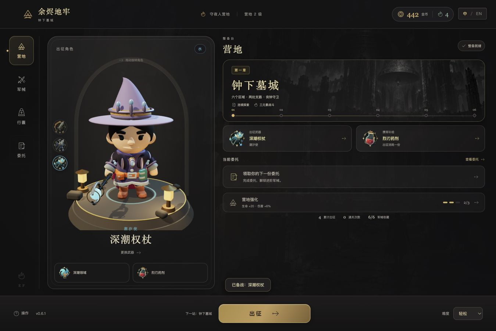

# 余烬地牢：钟下墓城

**Emberfall · v0.6.1 · [MIT](LICENSE)**

单人 3D 动作肉鸽游戏。整备装备与补给，从营地出征，在连续的地下城中清理怪群、选择祝福、探索支路，最终挑战丧钟守卫，再将战利品带回营地。



目前有一个可完整游玩的章节：六个主区域、两处支路、最终 Boss，以及火、雷、水三种元素和六把武器。营地提供军械、行囊、永久强化与四份委托。职业与技能随当前武器变化。

v0.6.1 统一炭黑、深灰与暖金界面；高级装备会同步改变肩甲、腕甲与头饰。待结算时可以整备下一局职业、武器和补给，旧战利品独立保留。本版修复了职业换装、领奖后移动、选卡时暂停恢复误领奖，以及最深关卡统计问题；新增中英文浏览器全流程自动化。见 [换装与界面记录](docs/v0.6.1-fixes.md)、[流程测试记录](docs/flow-automation.md)。

这是持续开发中的游戏，尚未具备完整开放世界、随机装备词条、联机或多章节内容。v0.4.1 修复了领取祝福后无法移动的问题。

## 启动

需要 **Node.js 22.12 或更新的 22.x 版本**及 npm。推荐使用电脑键鼠游玩，运行时无需账号或后端服务。

当前 v0.6.1 由 `main` 主分支提供。以下命令获取当前可游玩版本：

```sh
git clone https://github.com/we1jia/emberfall.git
cd emberfall
npm ci
npm run dev
```

浏览器打开 <http://127.0.0.1:4173/>。GitHub 仓库已公开，浏览与克隆无需登录；登录 GitHub 后即可 Fork。

预览构建版：

```sh
npm run build
npm run preview
```

macOS 也可以在完成 `npm ci` 和 `npm run build` 后，双击 `开始游戏.command`；这种启动方式需要 Python 3。终端启动方式为：

```sh
./开始游戏.command
```

`dist/` 与 `node_modules/` 不提交到仓库，首次克隆必须安装依赖；双击启动器前必须先构建。以上启动方式共用 4173 端口，同一时间只运行一种。保留启动终端，按 `Ctrl+C` 停止服务。

营地进度保存在当前浏览器的本地存储中，不跨浏览器或设备同步。清除站点数据会清除营地进度；战斗中的局内进度暂不支持关闭后恢复。

## 开始游玩

1. 在营地选择职业，或在军械中查看武器，再点 **装备出征**。点击军械卡片只查看详情，不会自动换装。
2. 在委托页领取任务；行囊中可购买补给，并选择一件带入下次出征。补给在出征时消耗一次。
3. 点击 **出征**，穿过连续六区。用范围技能清理怪群，闪避敌人预警，低血量时喝药。
4. 清场后选择祝福；出现可互动奖励或支路时按 `E`。祝福和临时 BUFF 仅在当前出征生效。
5. 击败丧钟守卫后回营，领取委托报酬、收藏战利品、强化营地，再整备下一次出征。也可在暂停界面提前收队；撤退只带回 25% 本局金币，死亡带回 60%。

## 元素与换装

| 职业 | 基础 / 高级军械 | 战斗特点 |
| --- | --- | --- |
| 火焰骑士 | 余烬长剑 / 烬王重剑 | 近战斩击、爆发火场、持续灼烧与短时增伤 |
| 雷刃游侠 | 引雷长枪 / 风暴战戟 | 快速突刺、范围雷击、远处连锁与攻速提升 |
| 潮汐使 | 涌泉法杖 / 深潮权杖 | 水域持续冲击、减速与护盾 |

高级军械会联动真实三维护甲、头饰和武器，营地与战场共用外观。当前穿着由军械决定，尚未提供独立护甲槽或随机装备词条。高级武器可通过战利品和委托奖励永久收藏。

## 语言

点击右上角 **中 / EN**，即可在简体中文和 English 之间即时切换。营地、装备、技能、任务、祝福、战斗提示和设置均支持双语，刷新后保留语言偏好。切换不重开战斗，也不会修改营地存档；默认简体中文。

## 圆润角色与营地整备

v0.6 为三种职业重做圆润几何与材质，营地和战斗共用真实模型与原有骨骼动作。营地采用侧栏导航、暖灯角色台和出征整备区；军械提供元素筛选、专属技能与真实出征属性对比，行囊提供库存、携带槽、购买、取下和永久强化路线。

[本版改进与验证](docs/v0.6-changes.md)、[圆润建模源文件说明](docs/models-v6.md)、[可爱素材与制作教程](docs/cute-art-guide-v6.md)。

## 操作

| 操作 | 按键 |
| --- | --- |
| 移动、瞄准 | `W A S D`、鼠标 |
| 普通攻击 | 鼠标左键 / `J` |
| 范围技能 | 鼠标右键 / `K` |
| 闪避、喝药 | `Space`、`Q` |
| 清场领奖、支路互动 | `E` |
| 选择祝福 | 点击卡片 / `1` `2` `3` |
| 装备面板、切换元素 | `B`、`Tab` |
| 暂停、返回 | `Esc` |

## 开发与验证

```sh
npm test
npm run test:flow
npm run build
```

当前全量回归 **157/157 通过**，其中 `test:flow` 流程子集 **86/86 通过**。`test:flow` 保存日志、JUnit 与 JSON 到 `artifacts/flow-automation/`，命令本身只执行 Node 测试。

运行本地服务后，可打开独立浏览器自动流程：

- [中文自动流程](http://127.0.0.1:4173/?qa=1&flow=1&seed=913)
- [English automated flow](http://127.0.0.1:4173/?qa=1&flow=1&seed=913&lang=en)
- [可见演示](http://127.0.0.1:4173/?qa=1&flow=1&seed=913&demo=1)

中英文各 **30 项浏览器检查通过**，均完成六区、293 击杀和最终 Boss，并验证领奖后移动、结算、委托领取、营地强化、再次出征与回营。流程页每次生成独立测试存档，保留普通游戏进度；右上角显示 PASSED/FAILED，完整结果可读取 `window.__emberfallFlow`。

战斗由固定 30Hz 输入机器人驱动，这些结果用于验证流程连通性，不能替代真人难度和长期性能测试。详细证据及覆盖边界见 [流程自动化验收](docs/flow-automation.md)。

游戏使用 JavaScript、Three.js 与 Vite。模型与贴图已随仓库提供，游玩无需安装 Blender。`blender/` 保留建模源文件；资产生成工具的环境要求见对应文档。

| 目录 | 内容 |
| --- | --- |
| `src/` | 战斗、地图、营地、动画与界面 |
| `public/` | 运行时模型、贴图、图标、声音与素材许可 |
| `blender/` | Blender 源文件与建模脚本 |
| `tests/` | 战斗、营地、交互与回归测试 |
| `tools/` | 本地启动及资产生成、检查工具 |
| `docs/` | 玩法、设计、素材来源及验收记录 |
| `artifacts/` | 版本截图与验证记录 |

采用 Gitflow：`main` 提供当前可游玩版本，`develop` 用于集成，功能在独立分支开发。本项目要求提交推送时，默认包含测试、README 更新、功能集成、主分支同步与远端核验；指定分支或限制合并时遵循当次要求。完整约定见 [AGENTS.md](AGENTS.md)。

## 开源许可与素材来源

本项目自有内容采用 [MIT 许可证](LICENSE)，允许使用、修改、分发和商用，需保留版权与许可声明。第三方代码和素材遵循其各自许可证，相关原文随素材保留；项目 MIT 许可不替代这些原有许可。

`package.json` 的 `private: true` 用于防止误发布 npm 包，不代表 GitHub 仓库私有。

## 项目文档

- [完整玩法与项目说明](docs/PROJECT.md)
- [当前验收记录](docs/ACCEPTANCE.md)
- [领取奖励后无法移动的修复记录](docs/reward-input-fix.md)
- [模型说明](docs/models.md)与[角色动画](docs/animation-v3.md)
- [第三方素材来源](docs/asset-research-v2.md)、[主视觉与声音](docs/art-assets.md)、[软件依赖](docs/DEPENDENCIES.md)

角色及部分场景素材来自 KayKit，部分 PBR 贴图来自 Poly Haven，对应素材使用 CC0；Three.js 使用 MIT 许可。具体出处与许可文件随素材保留。主视觉由图像生成工具生成，声音由项目脚本合成。
