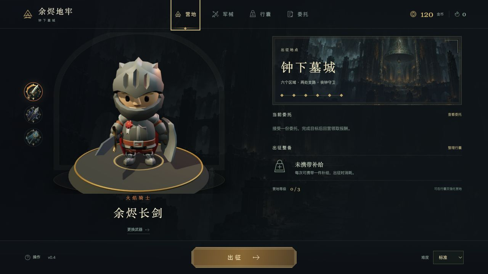

# 余烬地牢：钟下墓城

**Emberfall · v0.4.1**

单人 3D 动作肉鸽游戏。整备装备与补给，从营地出征，在连续的地下城中清理怪群、选择祝福、探索支路，最终挑战丧钟守卫，再将战利品带回营地。



目前有一个可完整游玩的章节：六个主区域、两处支路、最终 Boss，以及火、雷、水三种元素和六把武器。营地提供军械、行囊、永久强化与四份委托。职业与技能随当前武器变化。

这是持续开发中的游戏，尚未具备完整开放世界、随机装备词条、联机或多章节内容。v0.4.1 修复了领取祝福后无法移动的问题。

## 启动

需要 **Node.js 22.12 或更新的 22.x 版本**及 npm。推荐使用电脑键鼠游玩，运行时无需账号或后端服务。

```sh
git clone https://github.com/we1jia/emberfall.git
cd emberfall
npm ci
npm run dev
```

浏览器打开 <http://127.0.0.1:4173/>。私有仓库克隆需要具有仓库访问权限的 GitHub 账号。

预览构建版：

```sh
npm run build
npm run preview
```

macOS 也可以在完成 `npm ci` 和 `npm run build` 后，双击 `开始游戏.command`；这种启动方式需要 Python 3。终端启动方式为：

```sh
./开始游戏.command
```

`dist/` 与 `node_modules/` 不提交到仓库，首次克隆必须安装依赖；双击启动器前必须先构建。以上启动方式共用 4173 端口，同一时间只运行一种。保留启动终端，按 `Ctrl+C` 停止服务。

营地进度保存在当前浏览器的本地存储中，不跨浏览器或设备同步。清除站点数据会清除营地进度；战斗中的局内进度暂不支持关闭后恢复。

## 操作

| 操作 | 按键 |
| --- | --- |
| 移动、瞄准 | `W A S D`、鼠标 |
| 普通攻击 | 鼠标左键 / `J` |
| 范围技能 | 鼠标右键 / `K` |
| 闪避、喝药 | `Space`、`Q` |
| 清场领奖、支路互动 | `E` |
| 选择祝福 | 点击卡片 / `1` `2` `3` |
| 装备面板、切换元素 | `B`、`Tab` |
| 暂停、返回 | `Esc` |

## 开发与验证

```sh
npm test
npm run build
```

游戏使用 JavaScript、Three.js 与 Vite。模型与贴图已随仓库提供，游玩无需安装 Blender。`blender/` 保留建模源文件；资产生成工具的环境要求见对应文档。

| 目录 | 内容 |
| --- | --- |
| `src/` | 战斗、地图、营地、动画与界面 |
| `public/` | 运行时模型、贴图、图标、声音与素材许可 |
| `blender/` | Blender 源文件与建模脚本 |
| `tests/` | 战斗、营地、交互与回归测试 |
| `tools/` | 本地启动及资产生成、检查工具 |
| `docs/` | 玩法、设计、素材来源及验收记录 |
| `artifacts/` | 版本截图与验证记录 |

`main` 保留当前可交付版本，后续开发从 `develop` 分出功能分支。

## 文档与素材来源

- [完整玩法与项目说明](docs/PROJECT.md)
- [当前验收记录](docs/ACCEPTANCE.md)
- [领取奖励后无法移动的修复记录](docs/reward-input-fix.md)
- [模型说明](docs/models.md)与[角色动画](docs/animation-v3.md)
- [第三方素材来源](docs/asset-research-v2.md)、[主视觉与声音](docs/art-assets.md)、[软件依赖](docs/DEPENDENCIES.md)

角色及部分场景素材来自 KayKit，部分 PBR 贴图来自 Poly Haven，对应素材使用 CC0；Three.js 使用 MIT 许可。具体出处与许可文件随素材保留。主视觉由图像生成工具生成，声音由项目脚本合成。第三方素材的许可仅适用于对应素材，不代表整个项目采用同一许可。
