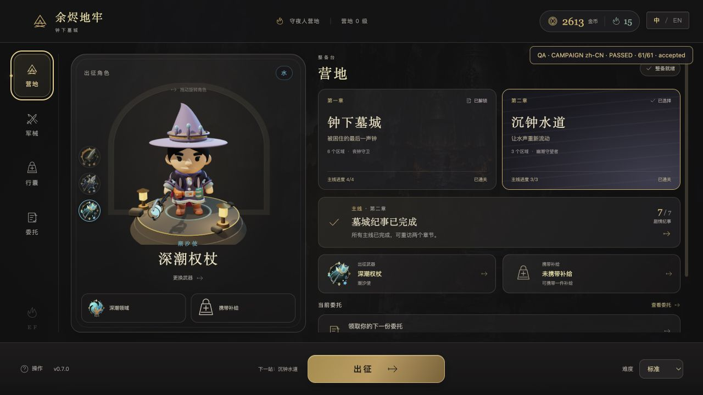
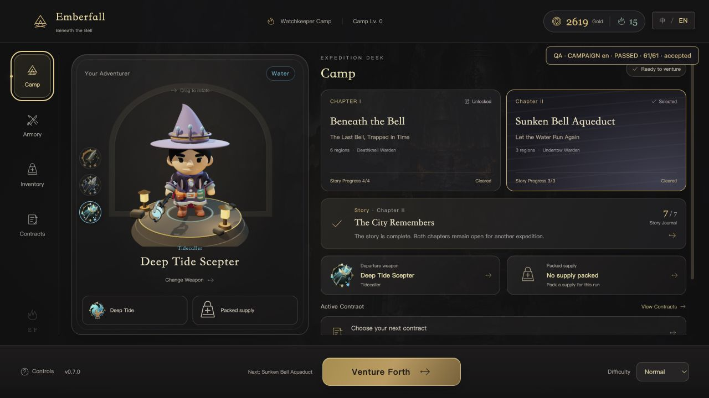
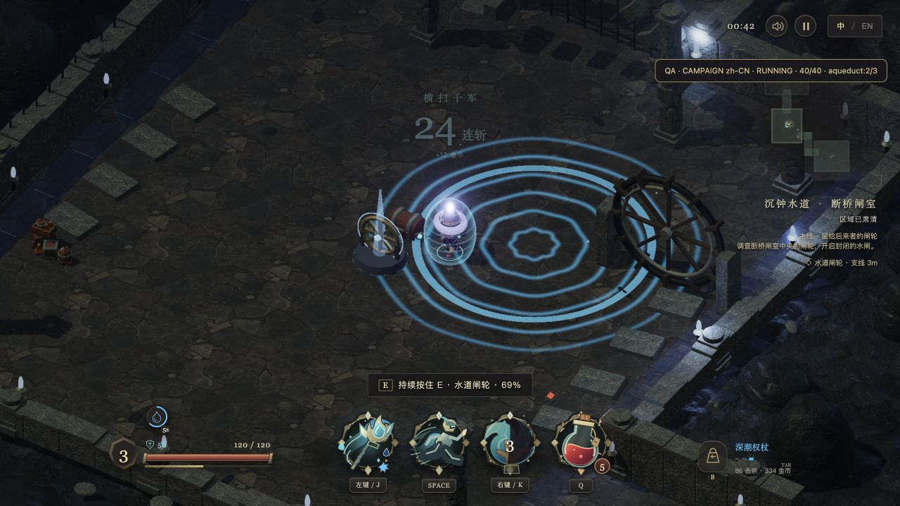

# v0.7.0 战役闭环验收

日期：2026-10-01。范围为两个可通关副本、七段主线与可靠交互，属于产品化里程碑，尚不是 v1.0 完整发行版。玩法依据、设计判断和后续范围分别见 [调研](product-research-v0.7.md)与[计划](product-roadmap-plan.md)。

## 已交付的玩法

- **钟下墓城**：保留六区与两处支路，新增铸钟铭印，四段纪事串联守夜人、档案员、铁匠和丧钟守卫。物证必须实际探索、清场与互动取得。
- **沉钟水道**：独立转折路线、三个区域、灰蓝水渠、连拱、闸轮和沉钟地标；定点水压先预警再伤害。幽潮守望者使用潮环、双涌浪和水弹；潮环内圈与外侧安全。
- **闸轮**：清场后持续按住 E 2.4 秒完成，本局 Boss 伤害降低 20%。释放、离开、受击、祝福弹窗会中断，重新操作可完成。
- **主线和营地**：章节选择、锁定原因、当前目标、顺序领奖与故事回看，中英文即时切换。第一章四段奖励领完后解锁水道，七段调查线有明确收束。
- **存档**：在原 V4 增加战役字段，保留原金币、收藏、补给、委托与统计；历史胜场不自动补新剧情。出征身份固定，探索物证跨局保留，Boss 物证必须胜利；结算和剧情领奖均幂等。

## 发现并修复的问题

1. **真实 E 输入只有一帧**：直接调用 Game 的输入测试可以通过，但 main.js 只传单次 interact 脉冲。改为同时读取 held KeyE；浏览器持续键盘事件和动画帧分别完成铭印与闸轮。
2. **祝福打断机关留下旧进度**：延迟经验可在持续操作时触发升级。弹窗开始时现在取消机关进度，选卡后可重新按住完成；浏览器同时验到了这种打断与重试。
3. **转角导航原地停留**：角色真实半径 0.48 在合法拐角，缓存导航按 0.5 判断起点不可达。内部图保持保守半径，起点和终点连接用角色真实半径。回归使用浏览器实际卡点和混合帧率，逐步走到补给箱并检查全过程未越墙。
4. **旧流程驱动不理解持续机关**：原驱动反复点 E，在铭印附近无法继续领奖。驱动现在保持 E 到机关结束，再释放重新领取；没有跳过机关或改玩家状态。
5. **自动验收的浮点误判**：2.4 秒可能累计为 2.399999999999878；仅为验收断言增加 1e-6 容差，未缩短游戏机关时间。

## 验证结果

| 层级 | 结果与证据 |
| --- | --- |
| 全量 Node 测试 | 200/200 通过，0 失败、0 跳过 |
| 流程回归子集 | 129/129 通过；[JSON](../artifacts/flow-automation/logic-report.json)、[JUnit](../artifacts/flow-automation/logic-junit.xml) |
| 正常属性三职业 | 火、雷、水使用不同种子，各连续通关两张地图，取得物证并领完七段；旧地图各 293 击杀，水道各 116；没有改生命、伤害、速度、坐标或怪物生成 |
| 中文战役浏览器 | 61/61 通过，最终结果见 [完整报告](../artifacts/campaign-v0.7/browser-zh.json)；两章通关、实际 E 长按、祝福打断、七段领奖与重载 |
| 英文战役浏览器 | 61/61 通过，最终结果见 [完整报告](../artifacts/campaign-v0.7/browser-en.json)；同一流程、完整英文界面 |
| 原营地浏览器流程 | 中文 30/30、英文 29/29；[中文报告](../artifacts/campaign-v0.7/legacy-browser-zh.json)、[英文报告](../artifacts/campaign-v0.7/legacy-browser-en.json)；覆盖职业、换装、领奖后移动、委托、强化、再次出征和回营 |
| 场景与输入 | 多次切图资源清理、共用素材保护、环境灯固定五盏、警示环空心几何、真实 main 输入回归 |
| 存档隔离 | 每次浏览器 QA 使用独立 .qa.flow.UUID；四个普通 profile/records/settings/locale 原始字符串保持一致 |
| 构建 | npm run build 成功；保留主包大于 500kB 的既有警告，没有据此声称性能达标 |

当前浏览器加载构建入口 `index-Cimk0qL8.js`，剧情驱动 `qa-campaign-runner-BL98iq4b.js`。[验证总览](../artifacts/campaign-v0.7/acceptance-summary.json)保留结果及源码哈希；[控制台与布局](../artifacts/campaign-v0.7/browser-evidence.json)、[普通入口](../artifacts/campaign-v0.7/normal-entry.json)分别核验。普通页三种 QA hook 均为 undefined，界面可见、控制台无警告或错误。旧调试页日志可能保留修复前失败，控制台结论按每次报告 startedAt 之后的日志核验，不抹掉历史错误。







## 重跑

```sh
npm ci
npm test
npm run test:flow
npm run build
npm run preview
```

另开 [中文两章流程](http://127.0.0.1:4173/?qa=1&campaign=1&seed=913)或[英文两章流程](http://127.0.0.1:4173/?qa=1&campaign=1&seed=913&lang=en)。读取 `window.__emberfallCampaignFlow`，必须是 passed 且每个 check 为 true；它与只跑 Node 的命令独立。

战斗采用名义 30Hz 的输入机器人并经过 main 事件、渲染和存档链路；持续机关用真实 main 的 KeyboardEvent 监听和 requestAnimationFrame。页面按钮由真实监听器处理。固定种子不保证浏览器定时器和帧调度逐帧相同，所以祝福次数、时间和最终检查数可能变化。

## 证据边界与后续

- 机器人知道敌人和攻击预警，不能替代真人平衡、趣味性、难度或时长验收。截图证明当前场景可见，不证明全部设备或长期帧率达标。
- 剧情目前是任务和纪事，不包含实体 NPC 对话或配音；两个副本仍为预先设计的固定布局，未声称随机地图或开放世界。
- 武器仍决定职业与穿着，没有独立护甲/饰品槽、随机词缀、云存档、联机或关闭后战场恢复。下一里程碑 v0.8 优先装备与构筑。
- 已有多标签恢复限制：其他标签页结算或替换同一次出征后，旧战场拒绝写回；原页面需刷新回营。未在本轮扩展该恢复界面，原存档不被旧状态覆盖。
- 没有部署公开试玩站点；当前交付是本地可玩构建及公开 MIT 源码。Gitflow 上传按照功能 → develop → 发布分支 → main → 同步 develop，远端提交在交付时现场核验。
