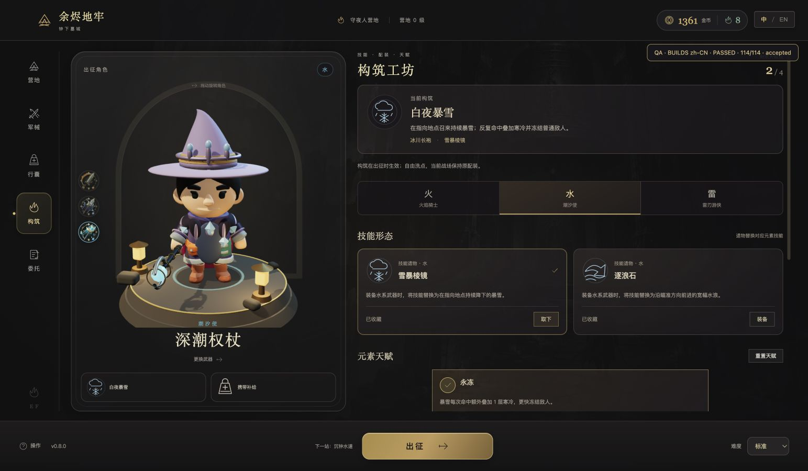
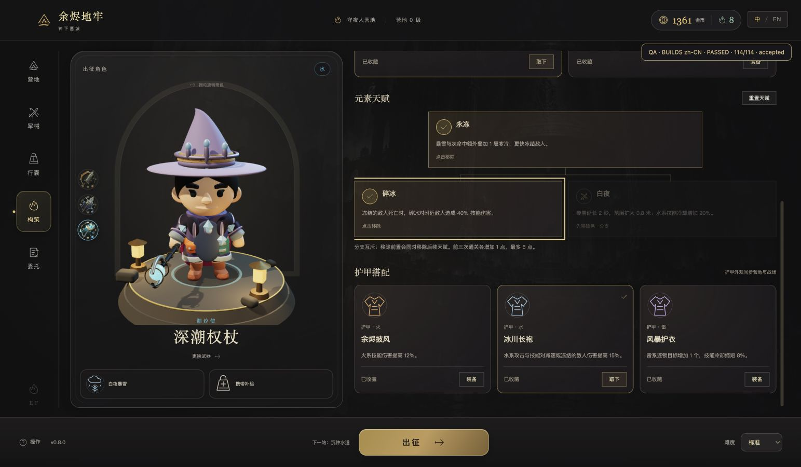

# v0.8 技能与构筑验收

验收日期：2026-10-02（Asia/Shanghai）。范围：六种真实 AOE 形态、独立护甲/技能遗物、九节点天赋、营地构筑工坊、中英文与旧存档兼容。机制研究见 [官方来源与主张对账](build-research-v0.8.md)。

## 已实现玩法

| 形态 | 实际命中规则 | 已核验的变化 |
| --- | --- | --- |
| 地脉焚柱 | 沿方向依次延迟喷发，单柱局部判定 | 余震回响、增压增加两根柱及范围；墙后不命中 |
| 坠星 | 鼠标落点，0.8 秒延迟落地后持续余火 | 距离/墙体裁剪、余震、施法伤害快照 |
| 白夜暴雪 | 鼠标落点持续脉冲，寒冷叠层和冻结 | 永冻加快冻结、碎冰死亡爆炸、白夜延时并增加冷却 |
| 奔潮 | 向前移动的宽幅波前扫过目标 | 减速、推开、每目标一次命中、墙体截断 |
| 导雷 | 首个方向目标后逐个跳跃 | 距离/遮挡约束、目标去重、传导、末端过载 |
| 裂空雷枪 | 三道方向线段穿透 | 同目标多线重叠只伤一次、回流返还上限 |

三件初始遗物免费收藏，另三件 100 金币；三件护甲各 70 金币。护甲骨骼挂件、披风/长袍/护衣和遗物徽记统一用于营地与战场。初始 3 点，前三次胜利增加至最多 6 点；天赋前置与互斥均由存档层验证，可免费洗点。旧 V4 存档添加中性构筑默认值，原技能与经济保留。

护甲、遗物与天赋在 prepareRun 时生成独立快照。下一局整备不改正在出征的效果。火系技能增伤不错误增加普攻；冰袍额外伤害按减速/冻结条件计算。不同元素冷却独立，切武器不能清零。Boss 冻结最多 0.12 秒且有 4 秒间隔；碎冰不递归，回流单次施法最多返还 1 秒。

## 模拟与旧流程

- 全量 **253/253**、流程子集 **182/182** 通过。详细数量见 [逻辑报告](../artifacts/builds-v0.8/logic-report.json) 和 [完整测试输出](../artifacts/builds-v0.8/full-tests.txt)。流程日志、JUnit 和 JSON 仍在 `artifacts/flow-automation/`。
- 六形态 × 两章，共 **12 次普通难度胜利**。各局基础 120 HP、26 攻击、5 速度，通过正常购买、天赋、prepareRun、输入移动/攻击/互动、祝福和实际结算推进。战场内正常获得的祝福可能提高生命等属性。
- 墓城每局 293 击杀及最终 Boss；水道每局 116 击杀及最终 Boss。主线七段、购买预算、重复结算不重复付款、重载和最大天赋预算覆盖。
- 可控战斗测试单独验证延迟、方向外侧不命中、遮挡、目标去重、快照、冻结间隔、碎冰递归边界和冷却返还上限。VFX 测试核验实际几何、质量降级、挂件挂骨与资源释放。

## Codex 内置浏览器

最终普通流程：中文 **114/114**、英文 **113/113**，全部通过；报告分别是 [中文](../artifacts/builds-v0.8/browser-zh.json)、[English](../artifacts/builds-v0.8/browser-en.json)。检查数量包括实际取得的逐次祝福；两种语言均真实点击职业、遗物、护甲、天赋和军械，打完整墓城并领取主线，解锁水道后逐一完成其余五种形态的实际战斗遭遇，再正常撤退结算。

浏览器这里只将暴雪完整通关；其余五种在水道的遭遇验证伤害与可视事件，不宣称浏览器已全通这五局。完整六形态两图通关由 Node 输入矩阵覆盖。

检查包括真实预算购买、未持有物品、互斥分支、取下遗物回退、不同元素回退、营地与战场实际穿着、施法事件与独立伤害来源、暴雪冻结、余震与过载、暂停停止模拟、正常回营清理几何、重载与结算记录。修复“取下遗物后键盘焦点跳到护甲取下按钮”，真实 DOM 检查确认焦点留在原遗物卡片。军械属性比较同步护甲/天赋，展示实际形态；新形态使用基准伤害及自身说明，隐藏不适用的旧圆形半径。

军械补充浏览器检查 **5/5** 通过：白夜天赋将冷却从 6.05 秒变为 7.26 秒；暴雪显示实际形态和基准伤害；查看不同元素武器时回退到原生技能，英文说明完整。见 [检查记录](../artifacts/builds-v0.8/armory-browser.json) 和 [军械画面](../artifacts/builds-v0.8/armory-en.png)。

中文 `capture=1` 演示还保存了六张真实画面，截图在模拟效果出现后暂停输入取得，没有改生命、坐标、敌人、伤害或发放测试货币。报告见 [演示](../artifacts/builds-v0.8/browser-capture-zh.json)。普通玩家的四个存储键（营地、记录、设置、语言）逐个原值对比保持不变；每个测试页使用唯一 `.qa.flow.` 键。

| 真实战场画面 | 图片 |
| --- | --- |
| 暴雪、落冰与冻结 | [blizzard.png](../artifacts/builds-v0.8/blizzard.png) |
| 地下火柱序列 | [pillars.png](../artifacts/builds-v0.8/pillars.png) |
| 延迟陨石 | [meteor.png](../artifacts/builds-v0.8/meteor.png) |
| 移动水浪 | [torrent.png](../artifacts/builds-v0.8/torrent.png) |
| 首目标连锁雷 | [chain.png](../artifacts/builds-v0.8/chain.png) |
| 三道穿透雷枪 | [lances.png](../artifacts/builds-v0.8/lances.png) |

## 构建与交付边界

构建成功；详细输出见 [build.txt](../artifacts/builds-v0.8/build.txt)。仍有主包超过 500 kB 的提示，尚未做跨设备帧率/加载时长验收。临时效果、雪片与共享粒子有质量预算，换房和回营清理；对象数量检查不是性能基准。

本版没有随机词缀、装备分解、联机或完整开放世界。天赋树保留小规模：水浪和雷枪的专属分支深度可继续扩展；现有九节点允许元素加成，但不是每个节点对所有同元素形态都有收益，界面逐项说明。真人爽感、配置强弱、长期刷图与不同设备性能还需试玩。

交付遵循 Gitflow：功能分支集成 develop，经发布分支合入 main，再同步 develop 并核验远端；最终提交与推送状态以本次交付回复中的实际核验为准。不包含公开试玩站点部署。
